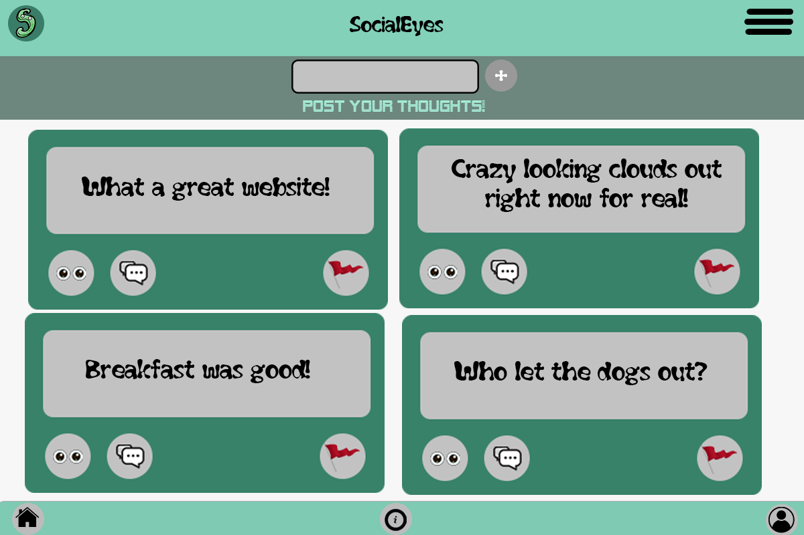
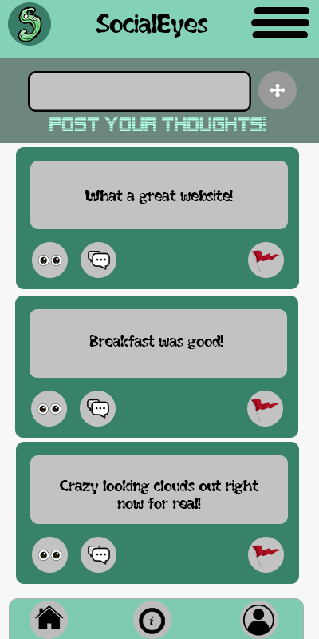
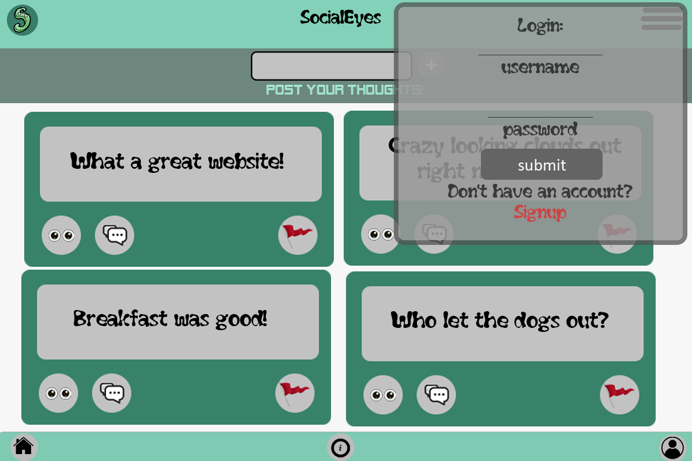

# Social Eyes antiSocial Media Website

### &nbsp;&nbsp;&nbsp;&nbsp; _SocialEyes...Social Media without being Social!_

---

## Intro

&nbsp;&nbsp;&nbsp;&nbsp;&nbsp;&nbsp; **SocialEyes** is an _anti_ Social Media App designed to quickly post thoughts, ideas, or musings for others to view, but not engage with. The point is simple: getting Eyes or Likes on your thoughts not you. Other users can see your posts and save them to their own profile if they like them.

&nbsp;&nbsp;&nbsp;&nbsp;&nbsp;&nbsp; All posts are public, but your name and info are not shown allowing a new layer of anonymity and judgement free sharing allowing you to share without reservation. Post away if you have something to share to the masses or just scroll through the feed looking for inspiration, a laugh, or just to kill the time!
**Lurk in peace.** Explore a diverse feed of anonymous posts at your own pace. No pressure to comment, like, or follow
just pure observation!

---

## Table of Content

1. [Description](#about)

1. [Technologies Used](#tech)

1. [Screenshots](#pics)

1. [Credits](#credits)

1. [Links](#links)

1. [Contact Me](#contact)

---

## Description

---

## Technologies Used

| _Technology_    | Purpose           |
| --------------- | ----------------- |
| **MongoDB**     | Database          |
| **Express**     | BackEnd Framework |
| **React**       | FrontEnd          |
| **Node**        | JS Environment    |
| **GraphQL**     | Query Language    |
| **Apollo**      | GraphQL Server    |
| **JWT**         | Authentication    |
| **Semantic UI** | CSS Framework     |
| **Bcrypt**      | Password Hashing  |
| **Framer**      | Animation/Motion  |
| **Render**      | Deployment        |

---

## Screenshots

    Click Here for More!

 

---

## Credits

Credits Here

---

## Links

### [Deployed Site](https://antisocialeyes.onrender.com/)

### [Repo](https://github.com/8BitGinger/antiSocialMedia)

---

## Contact Me

### Email:

[Gmail]()

### GitHub:

[8BitGinger](https://github.com/8BitGinger)

